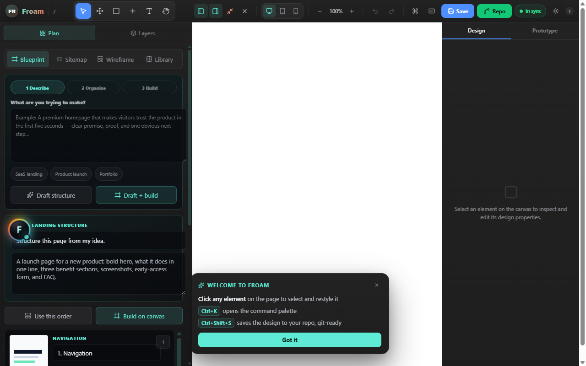

# Froam Studio

[](https://github.com/Ahmadastics/froam-studio/actions/workflows/ci.yml)
[](LICENSE)
[](package.json)

Your own visual web editor — Figma-style editing on top of **any live website**,
with **Repo Mode**: every visual edit compiles to real files in your git repo,
so `git push` ships your design to production. No database, no runtime API
dependency, no drift.



**Froam works with any project.** Vite, Next.js, Nuxt, SvelteKit,
Astro, Rails, Django, PHP, WordPress themes, plain HTML — if it serves a page,
Froam can edit it.

## 📱 v4: edit from your phone

Froam v4 is phone-first. Open your dev site on your phone
(`froam dev --host` + the LAN URL) and edit the mobile layout **on the
device where mobile bugs actually live** — every change still compiles to
committable files on your machine.

- **Touch canvas** — tap to select, long-press for the context menu (with
  haptics), drag to move with the Move tool, finger-sized resize handles.
  The page itself is the canvas; nothing is hidden on small screens.
- **Bottom sheet** — the design panel lives in a swipeable sheet with
  peek / half / full detents, so the page stays visible while you tune it.
- **Thumb dock** — the contextual bar docks above the sheet, in reach.
- **Selection walker** — parent / sibling / child steppers: tap *near* the
  thing you want, then walk to it. No more fat-finger misses.
- **Scrub to adjust** — press any number (font size, padding, radius,
  gap…) and drag sideways to change it, with haptic ticks. No phone
  keyboard round-trips.
- **Page palette** — Froam reads the colors your site already uses and
  offers them as one-tap chips (with a contrast check for text).
- **Quick looks** — one-tap style recipes: Lift, Glass, Outline, Pill,
  Pop, Reset.
- **Aa** — one tap to edit copy inline; the bar gets out of the keyboard's
  way.

## Install

```bash
npm install --save-dev git+https://github.com/Ahmadastics/froam-studio.git
```

That's it — the package ships prebuilt (`dist/` is committed), so installing
from GitHub needs no compile step, no registry, no token. Node 18+.

## Quick start (any project)

```bash
npx froam init     # detects your stack, scaffolds froam/, wires what it can
npx froam dev      # universal editor bridge
```

`froam dev` has three modes — pick whichever fits:

| Mode | Command | What happens |
| --- | --- | --- |
| **Proxy** (recommended) | `froam dev --app http://localhost:3000` | Your running dev server is proxied on `:4600` with the editor injected into every page. Zero code changes. HMR websockets pass through. |
| **Static** | `froam dev --serve .` | Serves a folder of plain HTML with the editor injected into every `.html`. |
| **Script tag** | `froam dev` | Bridge only. Add `<script src="http://localhost:4600/froam.js" defer></script>` to your own dev page. |

Edit visually, then **Save to Repo** (`Ctrl+Shift+S`). Froam writes committable
files — commit and push, done.

## How Repo Mode works

```
Froam editor (browser)
        │  "Save to Repo"  (Ctrl+Shift+S)
        ▼
froam bridge  (vite plugin middleware OR `froam dev` server)
        │  writes committable files
        ▼
froam/froam.design.json      ← canonical design store (v3)
froam/froam.generated.css    ← styles compiled to static CSS
froam/froam.runtime.js       ← zero-dependency vanilla runtime
        │  git add · commit · push
        ▼
Production ships the design — applied instantly, offline-safe
```

## Shipping to production

**Non-React sites** (static, Rails, PHP, anything): serve the two generated
files and add two tags — `froam init` does this automatically for static sites:

```html
<link rel="stylesheet" href="/froam/froam.generated.css">
<script src="/froam/froam.runtime.js" defer></script>
```

`froam.runtime.js` is a ~2 kB gzipped, dependency-free script that applies
text edits, image swaps and injected blocks; the CSS carries all styling.

**Vite + React apps** get the deepest integration (as in v2):

```tsx
import { FroamGate, FroamRuntime, type FroamLocalDesign } from 'froam-studio'
import 'froam-studio/css'
import 'froam-studio/gate-css'
import froamDesign from './froam'

<FroamRuntime design={froamDesign as FroamLocalDesign} routes="*" />
<FroamGate enabled initialOpen={false} localRoutes="*" />
```

Mount `FroamRuntime` exactly once and unconditionally. Gate the editor
(`FroamGate`) behind an env flag and/or `ownerEmails`. `froam init` wires
`froamStudio()` into your vite.config automatically.

## CLI

```
froam init             detect project type, scaffold froam files, wire everything
froam dev              universal editor bridge
    --app <url|port>     overlay the editor on any running dev server
    --serve [dir]        serve a static folder with the editor injected
    --port <n>           bridge port (default 4600)
    --open               open the browser once the bridge is up
    --host [addr]        expose on your local network (open the site on your phone)
froam build            recompile design.json → generated.css + runtime.js (CI-friendly)
froam status           design summary, artifact freshness, git state
froam doctor           health-check the whole setup
froam migrate          upgrade froam.design.json to v3
froam version          print the installed froam-studio version
```

All commands accept `--dir <path>` for a custom froam directory.
Project settings live in `froam.config.json` (written by `froam init`).

## Editor

- `Ctrl+K` command palette · `Ctrl+S` cloud save · `Ctrl+Shift+S` **Save to Repo**
- Layers, smart guides, resize handles, shape library, animator, versions panel,
  site planner, PNG/SVG/JPEG export, per-viewport editing (desktop/tablet/mobile)
- Dark & light editor themes, draggable panels, mobile bottom-sheet layout
- **Page scan** on first open — a laser sweep that maps every element on the
  page (real DOM counts, colour-coded), skippable and replayable from the
  palette (**Scan page**)

## Config

Use `apiBaseUrl`, `rootSelector`, `routeKey`, `enabled`, and `ownerEmails` props
when a host app needs explicit wiring. The vite plugin accepts
`froamStudio({ dir: 'src/froam' })`.

## Upgrading from v2

Designs migrate automatically on load; run `froam migrate` to rewrite the file
(v2 → v3 adds `meta` and the generated `froam.runtime.js`). The v2 React API
(`FroamGate`, `FroamRuntime`, `froam-studio/vite`) is unchanged.
