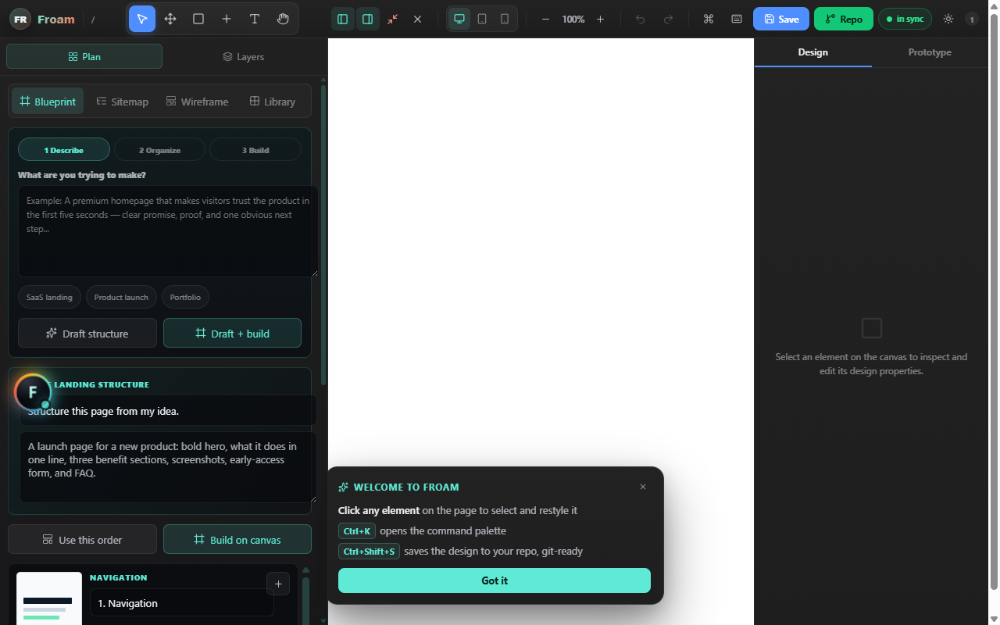

# Froam Studio

[](https://github.com/Ahmadastics/froam-studio/actions/workflows/ci.yml)
[](LICENSE)
[](package.json)

<p align="center">
  
</p>

Your own visual web editor — Figma-style editing on top of **any live website**,
with **Repo Mode**: every visual edit compiles to real files in your git repo,
so `git push` ships your design to production. No database, no runtime API
dependency, no drift.



**Froam works with any project.** Vite, Next.js, Nuxt, SvelteKit,
Astro, Rails, Django, PHP, WordPress themes, plain HTML — if it serves a page,
Froam can edit it.

## The mark

Colour is a frequency. Sound is a frequency. Interaction is a frequency.

<p align="center">
  
</p>

[A short piece on the identity](https://github.com/Ahmadastics/froam-studio/blob/main/docs/froam-demo.mp4)
— GitHub plays it in the file view. The mark at the top of this page is the
animated version, hand-built as SVG so it moves inline: GitHub strips scripts
from READMEs, so canvas and WebGL are off the table there.

## ✨ What's new

**7.1.0 — Intelligence Hardening.** Screenshot → Live UI now supports
multi-reference metadata, injectable local OCR, stable reconstruction IDs,
render/capture validation with a disclosed RGB-error metric, and a bounded
geometry-correction primitive. Identity health, safe observable-DOM framework
maintenance, checkpoint ancestry, incremental Scan, large-page profiling and
a limited branch-aware hosted project-sync contract harden the v7 substrate.
Screenshot and Predicted Attention remain Experimental.

**7.0.0 — Froam Understands.** The new Froam Intelligence surface turns the
live page into shared, provenance-aware Scan records and Component DNA. It adds
Component Archive, Design Archaeology, graph-backed Product Flow, Priority
Responsive and Breakpoint Cinema, plus clearly labelled local experiments for
Predicted Attention, Visual Rhythm and Screenshot → Live UI. Project schema v2
migrates v1 envelopes automatically; legacy designs and path-based generated
output remain unchanged.

**6.3.0 — Connected Canvas.** Open one focused surface for avatar presence,
deterministic Replay, isolated Prototypes, stable-node diagnostics, an
experimental project graph and the shared Interaction inspector. The v6.2
foundation is now visible and usable without changing path-based output.

**6.2.0 — Connected Canvas foundation.** Stable identities survive DOM movement,
the v3 design can live inside a versioned project envelope, and deterministic
history, checkpoint and branch primitives share one graph-ready substrate.
Existing designs and path-based output continue unchanged.

**6.1.0 — Froam Rooms.** Review a live site with a client or invite a second
designer into the same room: ordered co-editing, presence, cursors, soft locks,
chat, approvals, reconnect replay and per-actor undo share one small protocol.

**4.9.3 — a save reaches everywhere.** Publish from a phone and it lands on
every device *and*, with `createGitHubCommitter`, straight in your repo — no
`froam dev` bridge on the other end. See
[Publish straight to GitHub](#-publish-straight-to-github--no-laptop-required).

**4.9.2 — undo stops forgetting.** History is an append-only log of individual
edits instead of twenty whole-design snapshots, so undo goes back as far as the
work does and survives a reload.

**4.9 — Quick Looks becomes a gallery.** The `✦` one-tap style recipes went
from 6 to **71**, in ten browsable groups: Depth, Surface, Texture, Effect,
Shape, Line, Accent, Type, Bold, Reset.

**4.8 — publish everywhere.** The bridge is also a publish backend, and
`froam-studio/server` mounts the same contract on any stack.

**4.7 — perfect fidelity.** Fonts ship with the design, and a trailing slash
can no longer hide one.

**4.6 — the Blueprint goes 3D.** Every scanned element becomes a plane lifted
by its DOM depth: an exploded x-ray you can orbit, zoom, and tap to jump
straight to the element.

## 📐 the Blueprint

The first time Froam opens on a project, the page scan doesn't just count
what it finds — it **drafts it**. The scan resolves into a full engineering
blueprint of the site: drafting-blue grid paper, a wireframe recreation of
every element at true document scale, strokes that draw themselves in,
part labels with dimensions, callout leader lines to the key parts
(headline, nav, hero media, primary action, footer), a spec card with the
site's own palette and fonts, and a title block. **Tap any part to jump
straight to that element in the editor** — it's a navigable x-ray of your
site. Summon it anytime from the command palette ("Blueprint"), or flip it into
3D and orbit the page as stacked planes.

## 🫥 See-Through — visibility, opacity & depth

- **Opacity** — drag the `◐ %` chip on the contextual bar to fade any
  element: text, box, container, image.
- **Show / hide** — one-tap eye toggle; hidden elements stay in the Layers
  panel to bring back, and it's fully undoable.
- **Blend modes** — multiply, screen, overlay, and the rest.
- **Depth** — z-index control plus Bring-to-front / Send-to-back.

## 📱 Edit from your phone

Froam is phone-first. Open your dev site on your phone
(`froam dev --host` + the LAN URL) and edit the mobile layout **on the
device where mobile bugs actually live** — every change still compiles to
committable files on your machine.

- **Touch canvas** — tap to select, long-press for the context menu (with
  haptics), drag to move with the Move tool, finger-sized resize handles.
  The page itself is the canvas; nothing is hidden on small screens.
- **Bottom sheet** — the design panel lives in a swipeable sheet with
  peek / half / full detents, so the page stays visible while you tune it.
- **Thumb dock** — the contextual bar docks above the sheet, in reach.
- **Selection walker** — parent / sibling / child steppers: tap *near* the
  thing you want, then walk to it. No more fat-finger misses.
- **Scrub to adjust** — press any number (font size, padding, radius,
  gap…) and drag sideways to change it, with haptic ticks. No phone
  keyboard round-trips.
- **Page palette** — Froam reads the colors your site already uses and
  offers them as one-tap chips (with a contrast check for text).
- **Quick Looks** — 71 one-tap style recipes behind the `✦` button, grouped
  into Depth, Surface, Texture, Effect, Shape, Line, Accent, Type, Bold and
  Reset. Most derive their shades from the accent your page already uses.
- **Aa** — one tap to edit copy inline; the bar gets out of the keyboard's
  way.

## Install

```bash
npm install --save-dev git+https://github.com/Ahmadastics/froam-studio.git
```

That's it — the package ships prebuilt (`dist/` is committed), so installing
from GitHub needs no compile step, no registry, no token. Node 18+.

## Quick start (any project)

```bash
npx froam init     # detects your stack, scaffolds froam/, wires what it can
npx froam dev      # universal editor bridge
```

`froam dev` has three modes — pick whichever fits:

| Mode | Command | What happens |
| --- | --- | --- |
| **Proxy** (recommended) | `froam dev --app http://localhost:3000` | Your running dev server is proxied on `:4600` with the editor injected into every page. Zero code changes. HMR websockets pass through. |
| **Static** | `froam dev --serve .` | Serves a folder of plain HTML with the editor injected into every `.html`. |
| **Script tag** | `froam dev` | Bridge only. Add `<script src="http://localhost:4600/froam.js" defer></script>` to your own dev page. |

Edit visually, then **Save to Repo** (`Ctrl+Shift+S`). Froam writes committable
files — commit and push, done.

## How Repo Mode works

```
Froam editor (browser)
        │  "Save to Repo"  (Ctrl+Shift+S)
        ▼
froam bridge  (vite plugin middleware OR `froam dev` server)
        │  writes committable files
        ▼
froam/froam.design.json      ← canonical design store (v3)
froam/froam.generated.css    ← styles compiled to static CSS
froam/froam.runtime.js       ← zero-dependency vanilla runtime
        │  git add · commit · push
        ▼
Production ships the design — applied instantly, offline-safe
```

## Shipping to production

**Non-React sites** (static, Rails, PHP, anything): serve the two generated
files and add two tags — `froam init` does this automatically for static sites:

```html
<link rel="stylesheet" href="/froam/froam.generated.css">
<script src="/froam/froam.runtime.js" defer></script>
```

`froam.runtime.js` is a ~2 kB gzipped, dependency-free script that applies
text edits, image swaps and injected blocks; the CSS carries all styling.

**Vite + React apps** get the deepest integration (as in v2):

```tsx
import { FroamGate, FroamRuntime, type FroamLocalDesign } from 'froam-studio'
import 'froam-studio/css'
import 'froam-studio/gate-css'
import froamDesign from './froam'

<FroamRuntime design={froamDesign as FroamLocalDesign} routes="*" />
<FroamGate enabled initialOpen={false} localRoutes="*" />
```

Mount `FroamRuntime` exactly once and unconditionally. Gate the editor
(`FroamGate`) behind an env flag and/or `ownerEmails`. `froam init` wires
`froamStudio()` into your vite.config automatically.

## Publish — live designs across devices, no deploy

Froam has two ways to ship a design. **Save to Repo** bakes it into your
build (git-ready, versioned, permanent). **Publish** pushes it to a tiny
API so every device sees it on the next refresh — edit on your laptop,
refresh on your phone, no commit, no build.

Through `froam dev` this works out of the box: publishes land in
`froam/froam.published.json` next to your design, and any device that
loads the page through the bridge (`--host` for your phone on the same
Wi-Fi) picks them up.

For production, mount the same two-endpoint contract on your backend:

```js
import { createFroamPublishApi } from 'froam-studio/server'

const froamApi = createFroamPublishApi({
  file: 'froam/froam.published.json',
  authorize: async (req) => isAdmin(req),   // gate who can publish
})
app.use('/api/froam', (req, res, next) => {
  froamApi(req, res).then((handled) => { if (!handled) next() })
})
```

Then point the editor + runtime at it (`apiBaseUrl`). The contract, if
you'd rather implement it against your own database:

```
GET  /api/froam/published?routeKey=/&viewportMode=desktop
  -> { success: true, design: { routeKey, viewportMode, store, publishedAt } | null }
POST /api/froam/published        { routeKey, viewportMode, store }
  -> { success: true, design: { routeKey, viewportMode, publishedAt } }
```

By default committed repo designs win over published ones for the same route,
so the workflow is: publish to see it everywhere now → Save to Repo when it's
final. If you publish from devices that can't reach a repo, pass
`prefer="newest"` to `FroamRuntime` and whichever is more recent wins instead —
otherwise publishing to an already-committed route does nothing, with no
feedback.

## Froam Rooms — review and co-editing

One room serves two products. Send the commenter link for a guided client
review; send the editor link to open Studio mode with another designer. Roles,
ordered ops, comments, revisions, presence, chat and reconnect replay all use
the same contract.

`froam dev` mounts a file-backed room store automatically. A hosted app mounts
the identical rules over its own storage:

```js
import { createFroamRoomApi } from 'froam-studio/server'

const rooms = createFroamRoomApi({
  storage: {
    get: (roomId) => database.rooms.get(roomId),
    put: (room) => database.rooms.put(room.id, room),
  },
  authorize: async (req) => isDesigner(req),
})
```

The live stream is only a wake-up signal. Every durable change is read from the
server-ordered event log by cursor, so reconnects, duplicate submissions and a
serverless stream timeout are safe. Hosts should make `put` concurrency-safe;
the Run'Am adapter uses an optimistic database revision for this.

Invite links grant a role, while joining mints a separate per-member session.
Never treat the public actor id as authentication. Comments persist against
fingerprinted DOM anchors; room chat and cursor presence are session chrome and
never enter `froam.design.json`.

v7.1 also exports a limited-beta project-document delta endpoint for hosts that
need branch/checkpoint intelligence records across devices. It is intentionally
separate from—and subordinate to—the Room operation log:

```js
import { createFroamProjectSyncApi } from 'froam-studio/server'

const projectSync = createFroamProjectSyncApi({
  storage: projectStorage,
  authorize: async (req, { projectId, actor }) => mayEditProject(req, projectId, actor),
})
```

Design-operation events are refused unless they carry their canonical Room
sequence. Deltas are cursor-based, idempotent and branch-scoped; hosted storage
must still provide concurrency-safe `put` behavior.

## 🚀 Publish straight to GitHub — no laptop required

**Save to Repo** goes through the local `froam dev` bridge, so it only works on
the machine running it. Edit from your phone and there is no bridge: the design
reaches the publish API but never reaches the repo, and a design that isn't in
the repo isn't in the build.

Give the publish API a committer and one save does both legs. The design is
written through the GitHub Contents API, and whatever deploys from that repo —
Vercel, Netlify, Pages — picks it up on its own. No CI, no runner, no bridge.

```js
import { createFroamPublishApi, createGitHubCommitter } from 'froam-studio/server'

const froamApi = createFroamPublishApi({
  file: 'froam/froam.published.json',
  authorize: async (req) => isAdmin(req),
  commit: createGitHubCommitter({
    token: process.env.GITHUB_TOKEN,   // contents:write on the repo
    repo: 'you/your-site',
    branch: 'main',
    dir: 'src/froam',
  }),
})
```

The commit runs *after* the publish is safely stored and can never fail the
request, so a GitHub outage costs you a redeploy, never a design. Writes carry
the file's current sha, so two devices can't silently overwrite each other, and
the committed files are byte-identical to the ones the local bridge writes.

## CLI

```
froam init             detect project type, scaffold froam files, wire everything
froam dev              universal editor bridge
    --app <url|port>     overlay the editor on any running dev server
    --serve [dir]        serve a static folder with the editor injected
    --port <n>           bridge port (default 4600)
    --open               open the browser once the bridge is up
    --host [addr]        expose on your local network (open the site on your phone)
froam build            recompile design.json → generated.css + runtime.js (CI-friendly)
froam status           design summary, artifact freshness, git state
froam doctor           health-check the whole setup
froam migrate          upgrade froam.design.json to v3
froam version          print the installed froam-studio version
```

All commands accept `--dir <path>` for a custom froam directory.
Project settings live in `froam.config.json` (written by `froam init`).

## Editor

- `Ctrl+K` command palette
- `Ctrl+S` **Publish** — every device sees it on the next refresh
- `Ctrl+Shift+S` **Save to Repo** — writes committable files, needs the local bridge
- `Ctrl+Z` / `Ctrl+Y` undo & redo — unlimited, and survives a reload
- Layers, smart guides, resize handles, shape library, animator, versions panel,
  site planner, PNG/SVG/JPEG export, per-viewport editing (desktop/tablet/mobile)
- Dark & light editor themes, draggable panels, mobile bottom-sheet layout
- **Page scan** on first open — a laser sweep that maps every element on the
  page (real DOM counts, colour-coded), skippable and replayable from the
  palette (**Scan page**)

## Config

Use `apiBaseUrl`, `rootSelector`, `routeKey`, `enabled`, and `ownerEmails` props
when a host app needs explicit wiring. The vite plugin accepts
`froamStudio({ dir: 'src/froam' })`.

## Upgrading from v2

Designs migrate automatically on load; run `froam migrate` to rewrite the file
(v2 → v3 adds `meta` and the generated `froam.runtime.js`). The v2 React API
(`FroamGate`, `FroamRuntime`, `froam-studio/vite`) is unchanged.
